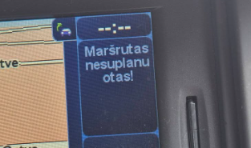
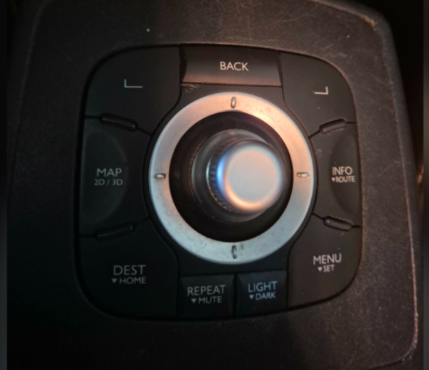
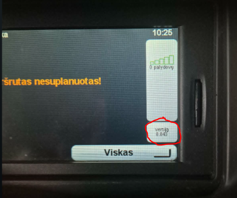
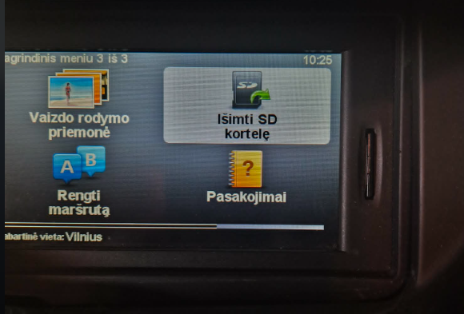
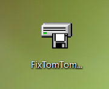
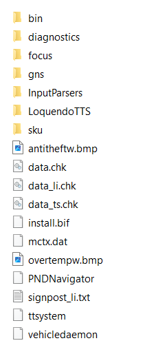

# Renault-Megane-Scenic-2009-2012m.-TomTom-laikrodis

2026m. balandžio mėnesį daug Renault Megane/Scenic, pagamintų 2009-2012m. su TomTom ne LIVE navigacijomis, nustojo rodyti laikrodį:
 

Čia trumpai aprašysiu, kaip galima pačiam greitai, turint kompiuterį su SD kortelių skaitytuvu, išspręsti šią problemą.

Kadangi problema susijusi GPS modulio skaitliuko užsipildymu, tai tikėtina, kad ir nieko nedarant, rugpjūčio mėnesį laikrodis pats vėl pradės rodyti.
Jeigu nuspręsite pats susitvarkyti, tai papasakosiu, kaip tai padaryti.

> [!IMPORTANT]
> **SVARBU:**
> - Tai ne oficialus problemos sprendimo būdas, o mano atrastas ir tikęs mano automobiliui, todėl visas galima rizikas prisiimate patys.

# Veiksmų eilės tvarka

1. Patikrinti navigacijos versiją:
- automobilio multimedijos valdymo joysticke paspausti ir palaikyti mygtuką "Info"

 - ekrane pasirodys navigacijos versija, atsiminkite ją

2. Išimti kortelę:

3. Į kompiuterį, kuris turi SD kortelių skaitytuvą atsisiųskite ir išarchyvuokite programėlę [failai](DS_1.zip) [FixTomTomClock.zip](https://drive.google.com/file/d/1459pXDus8ZQI1bFFx61Q9VE9fPHTLEIF/view)

4. Į kompiuterio kortelių skaitytuvą įstatykite kortelę ir failų naršyklėje išskleiskite jos turinį. Ieškokite failo pavadinimu `PNDNavigator`. Jeigu toks failas yra, tai praleiskite punktą 5. ir eikite iš karto į punktą 6. Jeigu nerandate tokio failo (kaip mano atveju), tai eikite į punktą 5.

5. Jeigu failo `PNDNavigator` nėra jūsų kortelėje, tai atsisiųskite ir išarchyvuokite į kompiuterio atskirą aplanką šiuos [failus](DS_1.zip)

Failus `PNDNavigator` ir `ttsystem` nukopijuokite į savo kortelės šaknį. Nežinau ar būtina, bet radau, kad pataria į kortelę nukopijuoti ir visus kitus aplankus ir failus, kurių dar nėra kortelėje. Aš sukėliau viską (išskyrus vieną, kuris jau buvo) ir pas mane viskas veikia.
